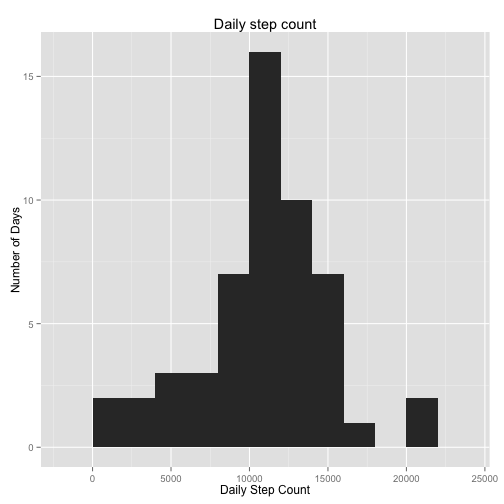
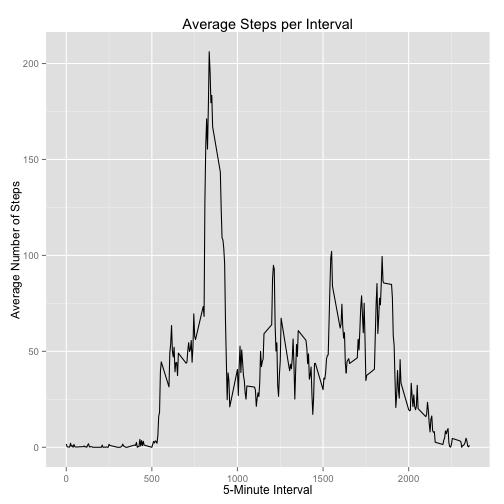
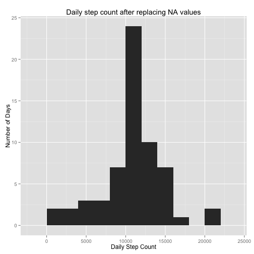
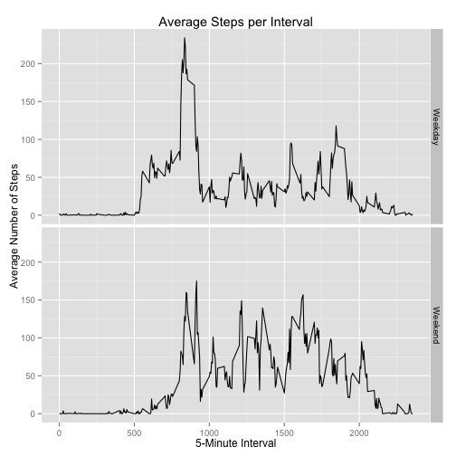

# Reproducible Research: Peer Assessment 1


## Loading and preprocessing the data

```r
library(dplyr, quietly = TRUE, warn.conflicts = FALSE)
activity <- read.csv("activity.csv")
activity$date<-as.Date(activity$date,"%Y-%m-%d")

stepsPerDay <- activity[!is.na(activity$steps),] %>% 
	group_by(date) %>% summarise(steps = sum(steps))

avgStepsPerInterval <- activity[!is.na(activity$steps),] %>% 
	group_by(interval) %>% summarise(avgSteps = mean(steps))
```


## What is mean total number of steps taken per day?

```r
library(ggplot2)

qplot(steps, data=stepsPerDay, geom="histogram", binwidth = 2000,  
	  ylab = "Number of Days", xlab = "Daily Step Count", 
	  main = "Daily step count")
```

 

#### Mean

```r
mean(stepsPerDay$steps)
```

```
## [1] 10766.19
```

### Median

```r
median(stepsPerDay$steps)
```

```
## [1] 10765
```

## What is the average daily activity pattern?

```r
qplot(interval, avgSteps, data=avgStepsPerInterval, geom = "line", 
	  ylab="Average Number of Steps", xlab = "5-Minute Interval", 
	  main = "Average Steps per Interval")
```

 

#### Interval with the most steps on average, across all days:

```r
top_n(avgStepsPerInterval, 1, wt = avgSteps)$interval
```

```
## [1] 835
```


## Imputing missing values

#### Total number of rows with NAs

```r
sum(is.na(activity$steps))
```

```
## [1] 2304
```

#### Filling the missing data with the average value across all days for that interval

```r
activity2 <- left_join(activity, avgStepsPerInterval, by = 'interval') %>% 
	mutate(steps = ifelse(is.na(steps), avgSteps, steps)) %>% 
	select(-avgSteps)

head(activity2)
```

```
##       steps       date interval
## 1 1.7169811 2012-10-01        0
## 2 0.3396226 2012-10-01        5
## 3 0.1320755 2012-10-01       10
## 4 0.1509434 2012-10-01       15
## 5 0.0754717 2012-10-01       20
## 6 2.0943396 2012-10-01       25
```

#### What is the impact of imputing missing data on the estimates of the total daily number of steps?

```r
stepsPerDay2 <- activity2 %>% group_by(date) %>% summarise(steps = sum(steps))

qplot(steps, data=stepsPerDay2, geom="histogram", binwidth = 2000,  
	  ylab = "Number of Days", xlab = "Daily Step Count", 
	  main = "Daily step count after replacing NA values")
```

 

#### Mean

```r
mean(stepsPerDay2$steps)
```

```
## [1] 10766.19
```

### Median

```r
median(stepsPerDay2$steps)
```

```
## [1] 10766.19
```

Because we used the mean to fill the NA values the number of days around the mean step count increased but the rest stayed the same. The mean din't change but the median is now equal to the mean.

## Are there differences in activity patterns between weekdays and weekends?

```r
activity3 <- activity %>% 
	mutate(day = as.factor(ifelse(weekdays(date) %in% c("Saturday", "Sunday"), "Weekend", "Weekday")))

avgStepsPerIntervalPerDaytype <- activity3[!is.na(activity3$steps),] %>% 
    group_by(day, interval) %>% summarise(avgSteps = mean(steps))

qplot(interval, avgSteps, data=avgStepsPerIntervalPerDaytype, geom = "line", 
	  ylab="Average Number of Steps", xlab = "5-Minute Interval", 
	  main = "Average Steps per Interval") + facet_grid(day ~ .)
```

 
